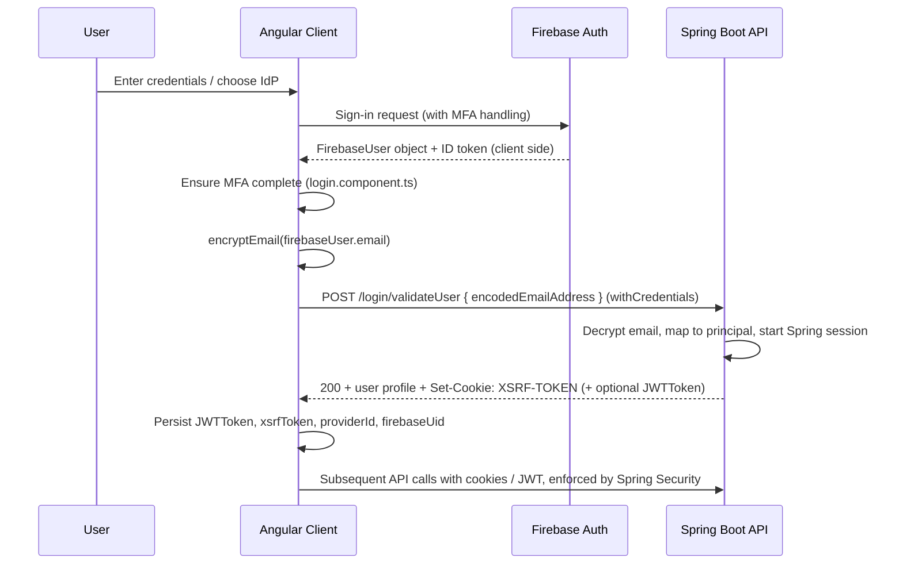

# Using Firebase for Authentication with a Spring Boot Backend for Authorization

This document explains why this project uses Firebase Authentication for identity (authentication) while continuing to use a Spring Boot backend for authorization and resource protection. It is written for IT/security managers and engineers who may not be familiar with Firebase and focuses on security advantages, operational benefits, implementation specifics, and best practices.

## Summary / quick answer

- Firebase Authentication manages user sign-in, account lifecycle, and MFA/federated identity, removing credential storage risk from our infrastructure.
- The Angular frontend (see `login.component.ts`) enforces MFA, then calls `login.service.ts::validateUser` to send an encrypted version of the Firebase user’s email to the Spring Boot endpoint `POST /login/validateUser`; the backend validates the identity, issues session/XSRF cookies, and continues to control authorization and business rules.
- This split keeps identity assurance with a specialist provider while allowing the backend to remain the system of record for authorization, auditing, and integration with existing Spring-based services.

## Current architecture in this repository

1. **Firebase sign-in & MFA** (handled in `login.component.ts`):
   - Users authenticate through Firebase Authentication (email/password, Google redirect, etc.).
   - The component forces multi-factor enrollment/verification before any backend call.
2. **Email encryption before backend call** (`login.service.ts::encryptEmail`):
   - If `environment.loginValidateSharedKey` is present, the email is encrypted client-side with AES-GCM (12-byte IV) and Base64 encoded.
   - If no key is present, the email is Base64 encoded plaintext; this fallback mirrors server behaviour for non-production environments.
   - `login.service.spec.ts` contains unit tests that verify both the encryption and fallback modes.
3. **Backend validation** (`login.service.ts::validateUser`):
   - Sends `{ encodedEmailAddress }` to `POST /login/validateUser` with `withCredentials: true` so cookies are exchanged.
   - The backend decrypts/validates the email and maps it to a Spring Security principal.
4. **Session establishment** (`login.component.ts::validateUserWithBackend`):
   - Success response must include an `XSRF-TOKEN` cookie. The client logs failure if the cookie is missing.
   - The response body may include a `JWTToken` plus user metadata (roles, provider information). These values are written to local storage and `TokenService` just as in the legacy login flow.
5. **Authorization & navigation**: Spring Boot remains responsible for role/permission checks; the frontend persists role, provider, and user identifiers for routing and follow-up API calls.

## End-to-end flow (current implementation)



### Session establishment detail

```mermaid
flowchart LR
  A[Firebase MFA complete] --> B[encryptEmail(email)]
  B --> C[POST validateUser]
  C --> D[Spring decrypts & validates user]
  D --> E[Spring issues session + XSRF cookie]
  E --> F[Client stores JWTToken (if any), xsrfToken, roles, provider info]
  F --> G[Client navigates to app and calls protected APIs]
```

## Why Firebase for authentication (security advantages)

1. **Delegated credential management** – Password hashing, breach detection, MFA enforcement, social sign-in, and account recovery are handled by a provider with dedicated security teams.
2. **Reduced attack surface for Spring Boot** – The backend never handles raw credentials; it only consumes validated identity assertions (currently encrypted email, recommended to evolve toward ID token validation).
3. **Built-in MFA and adaptive risk** – Firebase offers SMS, TOTP, and app-based second factors plus integrations with enterprise IdPs, letting us enforce strong authentication without building custom flows.
4. **Continuous security maintenance** – Firebase rotates signing keys, patches vulnerabilities, and provides audit logs, offloading upkeep from our engineering teams.
5. **Cross-platform consistency** – The same identity provider can serve web, mobile, and future clients, simplifying least-privilege enforcement and de-provisioning.

## Implementation-specific security considerations

1. **Shared AES key distribution**
   - Pros: adds confidentiality if requests traverse untrusted intermediaries.
   - Risk: embedding `loginValidateSharedKey` in a distributed frontend exposes it to reverse engineering. Anyone with the key could fabricate encrypted payloads.
   - Mitigation: avoid long-lived symmetric keys in client builds; prefer server-issued, short-lived keys or—better—switch to ID-token verification server side.

2. **Email-as-assertion vs. ID token**
   - Current design trusts the decrypted email to create a Spring session. This is weaker than verifying a Firebase ID token JWT (cryptographically signed by Google).
   - Recommendation: have the frontend send the Firebase ID token alongside the encrypted email (or instead of it) and validate it with the Firebase Admin SDK. This ties backend trust directly to Firebase’s signed assertion and enables revocation checks.

3. **XSRF cookie handling**
   - The client treats the `XSRF-TOKEN` cookie as proof of successful backend validation. Ensure cookies are issued with `Secure`, `SameSite=Lax` (or `Strict` if redirects are not needed), and short lifetimes.
   - Spring’s XSRF tokens are readable (not HttpOnly) by design; pair them with session cookies that are HttpOnly/SameSite for defense-in-depth.

4. **Local storage of JWTToken**
   - `tokenService.set` persists tokens for subsequent API calls. Assess the storage location (localStorage vs. sessionStorage) and consider moving to HttpOnly cookies to eliminate token theft via XSS.

5. **Debug helpers**
   - `debugBypassBackendValidation` exists for developer troubleshooting. Ensure it is excluded or feature-flagged in production builds.

6. **Provider ID normalization**
   - The client normalizes `providerId` from multiple possible backend fields, highlighting inconsistent backend responses. Standardizing the contract reduces logging of sensitive data.

7. **Unit-test coverage**
   - `login.service.spec.ts` confirms the AES-GCM encryption path and Base64 fallback, helping detect regressions if key handling changes.

## Recommended target improvements

- **Validate Firebase ID tokens server-side** using the Firebase Admin SDK (`FirebaseAuth.getInstance().verifyIdToken(...)`) and map the resulting UID/email to Spring authorities.
- **Phase out the shared symmetric key** or rotate it frequently via a secure secrets delivery channel if it must remain for backwards compatibility.
- **Tie session issuance to token recency** by checking JWT `auth_time` or revocation status to ensure stale sessions cannot survive credential resets.
- **Harden frontend storage** by preferring HttpOnly cookies for session/JWT data and minimizing sensitive data in localStorage.
- **Automate monitoring** for anomalies (rapid login failures, unexpected provider IDs) using Firebase audit logs plus backend metrics.

## Operational and security best practices

### Authentication hygiene

- Require MFA for privileged users (already enforced in UI) and consider conditional access policies for admins.
- Enable email verification and prevent unverified accounts from initiating sensitive workflows.
- Periodically review enabled Firebase providers; disable unused auth mechanisms.

### Token & session handling

- Validate every request that requires authorization by checking the XSRF token and/or JWT/session cookie.
- Re-fetch Firebase public keys periodically if you adopt ID token validation (Admin SDK handles this automatically).
- Implement logout/session revocation when Firebase credentials are revoked.

### Backend authorization boundaries

- Continue to map Firebase UIDs to Spring roles/permissions; do not trust client-provided roles.
- Store authorization metadata (role, providerId, userId) server-side for auditing rather than relying solely on client local storage.

### Monitoring & incident response

- Aggregate Firebase sign-in events into centralized logging.
- Alert on repeated failures, unexpected MFA bypass attempts, or absence of XSRF tokens.
- Maintain runbooks for key compromise, token revocation, and emergency lockouts.

## Checklist for IT Security review

- [ ] Backend validates Firebase assertions (ID token verification preferred; interim email decryption reviewed for key management risk).
- [ ] AES shared key, if still used, is stored/rotated via a secrets manager and **not** embedded in public builds.
- [ ] Spring issues session and XSRF cookies with Secure/SameSite attributes and enforces TLS-only access.
- [ ] MFA enforcement remains mandatory in `login.component.ts`; debug bypass is disabled in production.
- [ ] JWT/local storage usage reviewed; plan in place to migrate to HttpOnly cookies or other hardened storage.
- [ ] Monitoring captures Firebase auth events and Spring backend validation outcomes.
- [ ] Runbooks cover token revocation, session invalidation, and provider onboarding/offboarding.

## Suggested next steps and improvements

- Implement server-side Firebase ID token verification and update the frontend to send tokens alongside (or instead of) encrypted email.
- Expand automated tests to cover backend validation edge cases (invalid token, revoked account, expired MFA enrollment).
- Document onboarding steps for new developers (linking Firebase UID to backend accounts, handling provider IDs, rotating keys).
- Conduct a threat model focused on client-side key exposure and local storage of JWTs; track remediation items.

## Closing: recommended justification for IT Security leadership

Delegating authentication to Firebase lets us benefit from hardened credential storage, rapid MFA implementation, and enterprise identity integrations, while the Spring Boot backend keeps authority over authorization logic, role management, and data governance. By tightening how the frontend proves identity to the backend (moving toward Firebase ID token validation, securing key material, and enforcing strong session hygiene), we preserve Firebase’s security advantages and maintain a defensible posture that aligns with corporate security controls and compliance expectations.
