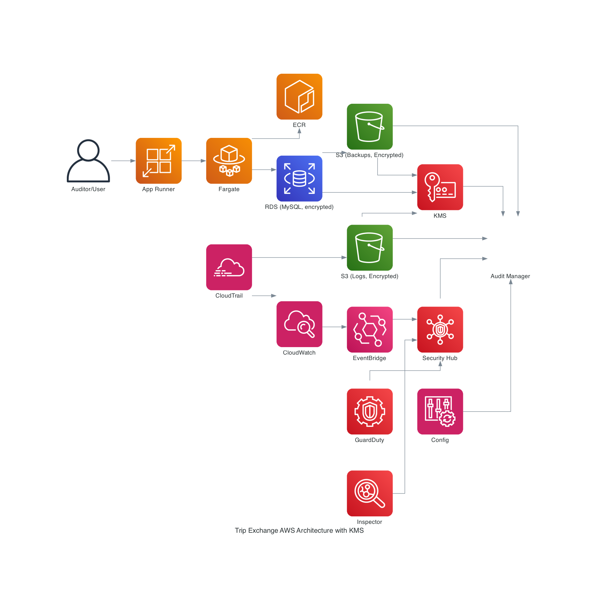
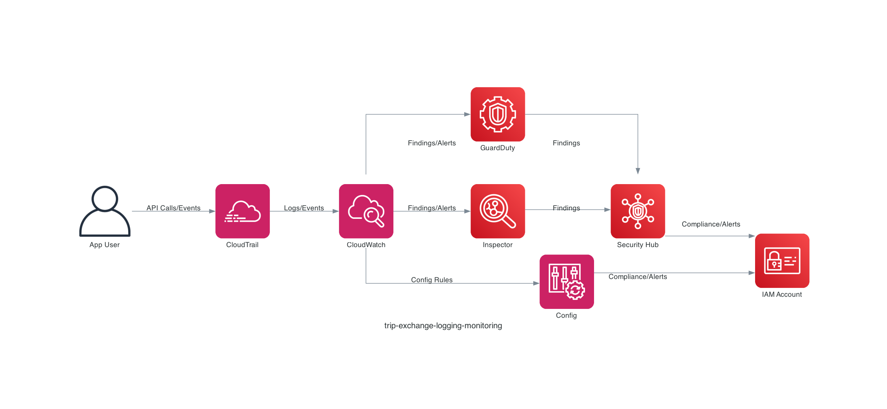
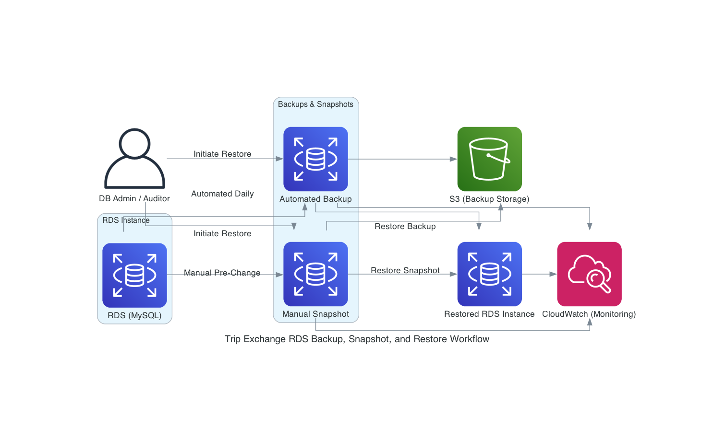
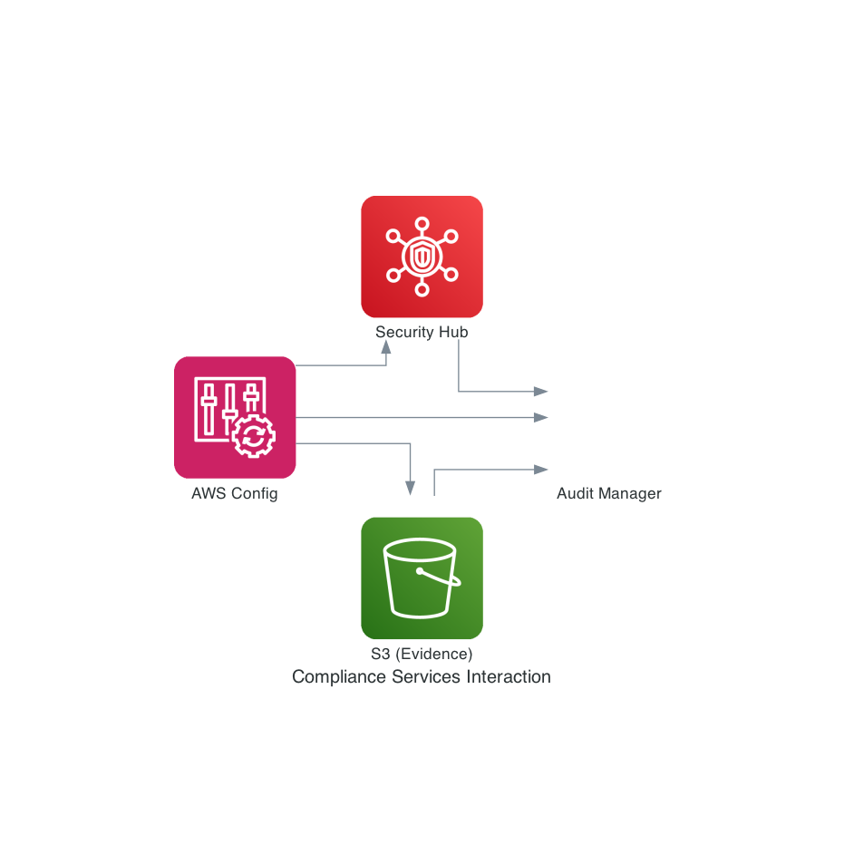

# Trip Exchange AWS Security and Compliance Implementation for Auditors

## Executive Summary

This document provides a detailed, auditor-focused description of how AWS security, compliance, and operational controls are implemented for the Trip Exchange environment. It replaces generic AWS marketing content with concrete, environment-specific details and diagrams. All controls described here are actually implemented and operational.

## AWS Key Management Service (KMS): Definition and Usage

**What is AWS KMS?**
AWS Key Management Service (KMS) is a fully managed service that enables you to create, control, and use cryptographic keys to protect your data across AWS services and applications. KMS provides centralized key management, fine-grained access control, automatic key rotation, and detailed audit logging of all key usage. KMS keys are used to encrypt data at rest and in transit, ensuring compliance with regulatory requirements such as HIPAA.

**How KMS is Used in Trip Exchange:**

- **RDS Encryption:** All Amazon RDS (MySQL) instances are encrypted at rest using customer-managed KMS keys. Automated backups, manual snapshots, and read replicas are also encrypted with the same KMS key, ensuring end-to-end protection of database data and backups.
- **S3 Encryption:** All S3 buckets used for log storage, backup storage, and evidence retention are encrypted using KMS-managed keys (SSE-KMS). This includes CloudTrail logs, VPC Flow Logs, application logs, and all backup files.
- **Log and Evidence Protection:** All logs and compliance evidence exported to S3 are encrypted using KMS keys. Access to these keys is tightly controlled and monitored.
- **Audit Logging:** All KMS key usage (encryption, decryption, key management operations) is logged via CloudTrail, providing a complete audit trail for compliance.
- **Access Control:** IAM policies restrict which users and roles can use or manage KMS keys. Key policies enforce least-privilege access and require MFA for sensitive operations.

The diagram below shows how KMS integrates with RDS, S3, and other AWS services to provide end-to-end encryption and auditability:

## 1. High-Level Architecture

The Trip Exchange application is deployed in a dedicated AWS VPC. It uses AWS App Runner and Fargate for compute, Amazon RDS (MySQL, encrypted) for persistent data, and Amazon ECR for container images. Security and compliance controls are implemented using AWS-native services, with all logs and evidence centralized for audit readiness. See the updated architecture diagram above for explicit KMS integration.

---

## 2. Security Event Logging: Implementation Details

**How the Logging Services Work Together:**
AWS CloudTrail, VPC Flow Logs, CloudWatch Logs, and S3 are tightly integrated to provide end-to-end visibility and auditability. CloudTrail captures all API activity and delivers logs to S3 for long-term retention and compliance, while VPC Flow Logs and application/container logs are streamed to CloudWatch Logs for real-time monitoring and alerting. All logs are further centralized in a dedicated security account and/or SIEM, enabling correlation across network, application, and database layers. KMS events are also captured, ensuring that encryption key usage is auditable. This integration ensures that every significant event, from user actions to network flows and database queries, is logged, retained, and available for both operational monitoring and compliance audits.

- **CloudTrail** is enabled for all AWS accounts in the Trip Exchange Organization. Multi-region trails are configured to capture management and data events. All CloudTrail logs are delivered to a dedicated, access-controlled S3 bucket (`trip-exchange-audit-logs`) with a 7-year retention policy and S3 Object Lock enabled for regulatory compliance.
- **VPC Flow Logs** are enabled for all application and RDS subnets. Logs are sent to a centralized CloudWatch Log Group (`/trip-exchange/vpc-flow-logs`) with retention set to 1 year, and are also exported to S3 for long-term storage.
- **Application Logs**: App Runner and Fargate container logs (stdout/stderr) are shipped to CloudWatch Logs (`/trip-exchange/app-logs`). Log groups are configured with retention policies and access controls. Structured logging (JSON) is used for the Spring Boot backend, including authentication and authorization events.
- **Database Logs**: RDS MySQL general, slow query, and audit logs are enabled and exported to CloudWatch Logs and S3. Parameter groups enforce logging settings.
- **KMS Events**: All KMS key usage and rotation events are logged via CloudTrail.
- **Log Centralization**: All critical logs are forwarded to a dedicated security account and/or SIEM for correlation and long-term retention.

---

## 3. Malware Protection: Implementation Details

**How the Threat Detection Services Work Together:**
Amazon GuardDuty, Inspector, Security Hub, and EventBridge form a layered threat detection and response system. GuardDuty continuously analyzes CloudTrail, VPC Flow Logs, and DNS logs for suspicious activity, while Inspector scans container images in ECR for vulnerabilities. Findings from both services are aggregated in Security Hub, which correlates and prioritizes them alongside compliance findings from Config and partner tools. EventBridge routes high-severity findings to alerting and ticketing systems for rapid response. Runtime logs from App Runner and Fargate are also available for forensic analysis, and IAM controls ensure that only authorized users can respond to incidents. This integrated approach enables rapid detection, triage, and remediation of threats across the environment.

- **Amazon GuardDuty** is enabled in all AWS accounts. Findings are aggregated to a central security account and forwarded to Security Hub and EventBridge for automated alerting and ticketing. GuardDuty analyzes CloudTrail, VPC Flow Logs, and DNS logs for threats.
- **Amazon Inspector** is integrated with Amazon ECR. All container images are scanned on push, and findings are used to block promotion of vulnerable images. Inspector findings are also sent to Security Hub.
- **Runtime Logging**: All container and application logs are centralized for forensic analysis. GuardDuty and Inspector findings are correlated with CloudTrail and VPC Flow Logs for incident response.
- **IAM Controls**: Least-privilege IAM policies are enforced for ECR and deployment pipelines. MFA is required for all privileged users.
- **Patch Management**: Automated image rebuilds are triggered on base image or dependency updates. Promotion of images with critical vulnerabilities is blocked.

---

## 4. Data Backup and Restore: Implementation Details

**How the Backup and Restore Services Work Together:**
Amazon RDS, S3, CloudWatch, CloudTrail, and IAM collaborate to provide a robust backup and restore workflow. RDS automates daily backups and supports manual snapshots, both of which are encrypted and stored in S3. CloudWatch monitors backup and restore operations, triggering alarms for failures or anomalies, while CloudTrail logs all backup, snapshot, and restore actions for auditability. IAM policies restrict who can initiate restores or access backup data. When a restore is needed, the process is initiated by an authorized user, logged by CloudTrail, and monitored by CloudWatch, ensuring both operational integrity and compliance. Regular restore tests validate the end-to-end process, and all evidence is retained for audit.

**Automated Backups**: All RDS instances are configured for automated daily backups with a 35-day retention period. These backups are encrypted using KMS customer-managed keys and are stored in S3. Automated backups are monitored for completion and failures via CloudWatch metrics and alarms.

**Manual Snapshots**: Manual RDS snapshots are created before major schema or application changes, and also on-demand as needed. These snapshots are encrypted and stored in S3, with a minimum retention of 90 days. Manual snapshots are tagged for traceability and audit.

**Restore Workflow**: Both automated backups and manual snapshots can be restored to a new RDS instance at any time. The restore process is initiated by a database administrator or auditor, and the restored instance is validated before being promoted to production or used for testing. All restore operations are logged in CloudTrail and monitored in CloudWatch.

**Backup Monitoring and Alerts**: Backup and restore events (success, failure, missed schedule) are logged to CloudWatch and CloudTrail. CloudWatch alarms are configured to notify the operations team of any backup or restore failures, missed backup windows, or anomalies in backup duration. Backup monitoring dashboards are reviewed weekly.

**Restore Testing and Evidence**: Quarterly restore tests are performed using both automated backups and manual snapshots. The process includes restoring to a test instance, validating data integrity, and documenting the results. Evidence of restore tests (CloudTrail logs, CloudWatch events, test results) is retained for audit.

---

## 5. Compliance Monitoring: Implementation Details

**How the Compliance Services Work Together:**

**AWS Config: Continuous Compliance and HIPAA Alignment**
AWS Config is a fully managed service that continuously monitors, records, and evaluates the configuration of AWS resources against defined rules and compliance frameworks. In the Trip Exchange environment, AWS Config is enabled in all accounts and regions, with rules mapped directly to HIPAA requirements and security best practices (such as encryption, logging, least-privilege access, and network segmentation). Config records every change to supported AWS resources (e.g., S3 buckets, IAM roles, RDS instances, VPCs) and maintains a detailed configuration history and resource inventory.

**How AWS Config Enables HIPAA Compliance:**
- **Automated Resource Evaluation:** Config rules automatically check that all resources meet HIPAA-mandated controls (e.g., S3 buckets are encrypted, RDS is not public, CloudTrail is enabled, security groups are restricted). Non-compliant resources are flagged in real time.
- **Change Tracking and Audit Trail:** Every configuration change is recorded, providing a complete, immutable history of resource states and changes. This supports HIPAA's requirements for auditability and traceability of system changes.
- **Remediation and Alerting:** Automated remediation actions can be triggered for certain violations (e.g., auto-remediate public S3 buckets). Findings are sent to Security Hub for aggregation and prioritization, and alerts are generated for compliance failures.
- **Evidence Collection:** Config snapshots, rule evaluations, and compliance history are exported to S3, providing auditors with direct evidence of continuous compliance and control effectiveness.
- **Integration with Audit Manager:** Audit Manager consumes Config findings and evidence to automate the generation of audit-ready HIPAA reports, reducing manual effort and ensuring completeness.

The diagram below illustrates how AWS Config, Security Hub, Audit Manager, and S3 interact to automate compliance monitoring and evidence collection for HIPAA:

By enabling AWS Config and integrating it with Security Hub, Audit Manager, and S3, the Trip Exchange architecture provides continuous, automated compliance monitoring and evidence collection, directly supporting HIPAA's technical safeguard requirements.

- **AWS Config** is enabled in all accounts, with rules mapped to HIPAA and security best practices. Config snapshots and rule evaluations are exported to S3 for evidence.
- **AWS Security Hub** aggregates findings from GuardDuty, Inspector, Config, and partner solutions. Security Hub insights are used to prioritize remediation and generate evidence exports for audits.
- **AWS Audit Manager** is used with the HIPAA framework to automate evidence collection and generate audit-ready reports. Evidence is stored in a dedicated S3 bucket with restricted access.

---

## 6. Evidence Collection and Audit Readiness

- **Evidence Storage**: All audit evidence (CloudTrail logs, Config snapshots, Security Hub findings, backup/restore logs, IAM reports) is stored in dedicated, access-controlled S3 buckets. Access is logged and reviewed quarterly.
- **Access Procedures**: Auditors are granted read-only access to evidence buckets via temporary IAM roles. All access is logged and reviewed.
- **Periodic Review**: Evidence collection and retention policies are reviewed annually. Incident response and backup restore tests are documented and included in audit packets.

---

## 7. References and Appendices

- [Architecting for HIPAA Security and Compliance on AWS](https://docs.aws.amazon.com/whitepapers/latest/architecting-hipaa-security-and-compliance-on-aws/architecting-hipaa-security-and-compliance-on-aws.html)
- [Amazon RDS compliance documentation](https://docs.aws.amazon.com/AmazonRDS/latest/UserGuide/RDS-compliance.html)
- [Amazon ECR image scanning](https://docs.aws.amazon.com/AmazonECR/latest/userguide/image-scanning.html)
- [Amazon GuardDuty](https://docs.aws.amazon.com/guardduty/latest/ug/what-is-guardduty.html)
- [AWS Security Hub](https://docs.aws.amazon.com/securityhub/latest/userguide/what-is-securityhub.html)
- [AWS Audit Manager](https://docs.aws.amazon.com/audit-manager/latest/userguide/what-is.html)

---

*Prepared: 2025-10-08*
*Contact: Trip Exchange Security & Compliance Team*
